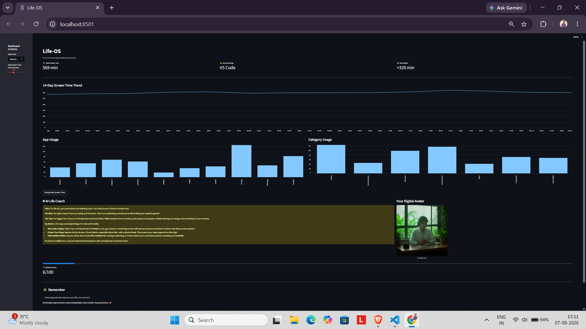

# 📱 Life-OS

An AI-powered Digital Wellbeing Dashboard built using Streamlit and Gemini API.

## Features

- 14-Day Screen Time Analytics
- Interactive Dashboard
- Daily App & Category Usage
- Screen Time Goal Tracking
- AI Productivity & Lifestyle Coach
- AI Generated Digital Avatar
- Clean SaaS-style Interface

## Tech Stack

- Python
- Streamlit
- Pandas
- Google Gemini API
- Pollinations AI
- Requests

## Project Structure

```
Life-OS/
│
├── app.py
├── screentime.csv
├── .env
├── requirements.txt
└── README.md
```

## Installation

```bash
git clone https://github.com/Abhishek-Satyarum/Life-OS.git

cd Life-OS

pip install -r requirements.txt
```

Create a `.env` file:

```env
GEMINI_API_KEY=YOUR_API_KEY
```

Run:

```bash
streamlit run app.py
```

## Screenshots



## Author

**Abhishek Satyarum**